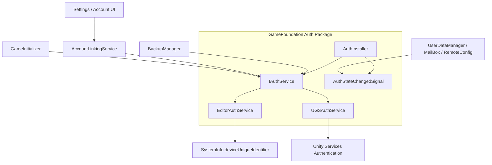
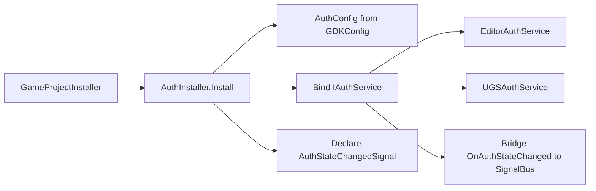
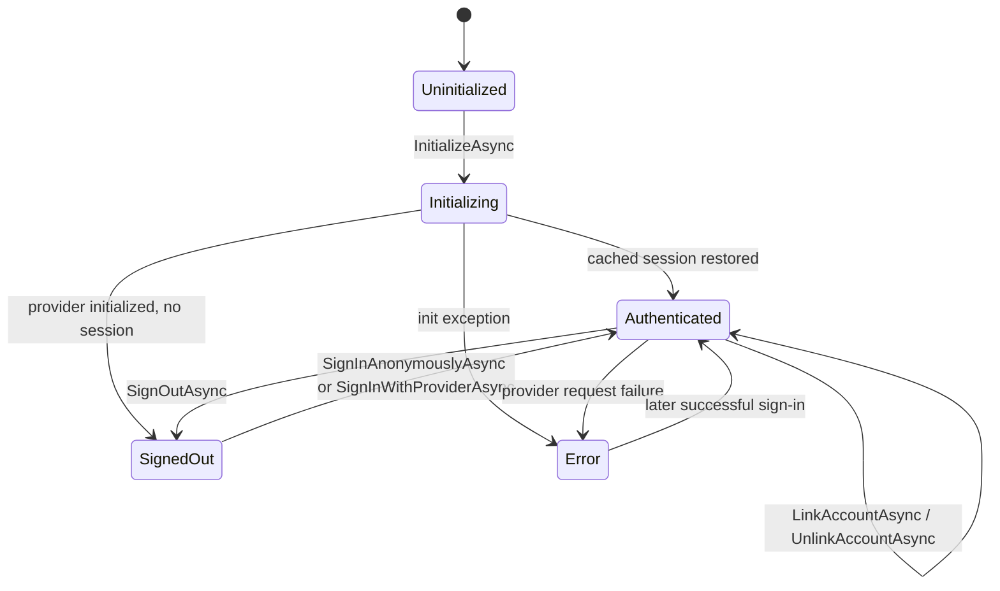
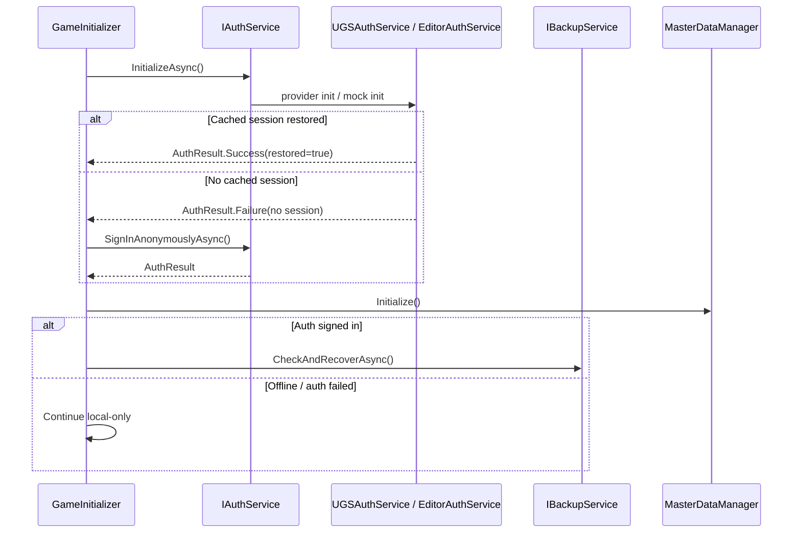
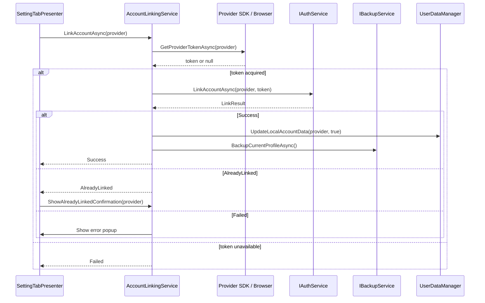

# TDD: Auth Technical Design

> Technical design document for the implemented Auth module.
> The concise operating reference is [auth_system.md](auth_system.md).

## 1. Design Goals

- Provide one provider-agnostic authentication API for game systems.
- Keep Unity Gaming Services SDK details inside the Auth implementation layer.
- Let the game remain playable when auth is unavailable.
- Support anonymous-first onboarding with optional provider linking later.
- Publish auth state changes in a way both reusable package code and game-layer code can consume.

## 2. System Context



Auth sits between game systems and provider SDKs. Consumers depend on `IAuthService` and `AuthStateChangedSignal`, not on UGS types.

## 3. Module Boundaries

| Boundary | Owned by Auth package | Owned outside Auth package |
|---|---|---|
| Provider session | Initialize, sign in, sign out, link, unlink, linked-provider list. | UI prompts, account switch decisions, data backup before destructive operations. |
| Provider token | Accepts token string. | Acquires token through browser/native SDK flows. |
| State broadcast | C# event plus Zenject signal bridge. | Game-specific subscribers and UI refresh logic. |
| Offline behavior | Returns failures and does not throw intentionally on normal auth failures. | `GameInitializer` decides to continue local-only. |
| Data recovery | Exposes `PlayerId` and linked state. | Backup module handles cloud data. |

The key design choice is that credential acquisition is outside the reusable package. Simple providers still pass one token string, while providers such as Apple Game Center pass a structured credential. This keeps Auth reusable across games that may use different UI, native SDKs, or provider rollout plans.

## 4. Dependency Injection Design



Selection rules:

| Condition | Bound service |
|---|---|
| Unity Editor and `UseMockInEditor == true` | `EditorAuthService` |
| `UGS_AUTH` defined and mock disabled or runtime build | `UGSAuthService` |
| `UGS_AUTH` missing | `EditorAuthService` fallback |

This design keeps developer iteration available without a configured UGS dashboard. Runtime builds should include `com.unity.services.authentication` so `UGS_AUTH` is defined.

## 5. State Machine



`AuthResult.IsSessionRestored` distinguishes a restored cached session from a new sign-in. `AuthSessionInfo.FromResult()` converts operation results into event/signal payloads.

## 6. Startup Sequence



Auth failure is non-fatal by design. `GameInitializer.InitializeAuthAsync()` catches exceptions and logs a warning before continuing.

## 7. Account Linking Sequence



The Auth package only receives the token. It does not know how the token was produced.

## 8. Provider Implementation Design

### EditorAuthService

`EditorAuthService` is deterministic and local-only. It never calls network services. Its responsibilities are to support editor play mode, automated testing, signal firing, linked-provider UI flows, and stable local PlayerId generation.

Data shape:

```text
state: AuthState
playerId: string
isAnonymous: bool
linkedProviders: List<AuthProvider>
```

### UGSAuthService

`UGSAuthService` wraps UGS Authentication. It owns:

- `UnityServices.InitializeAsync()`.
- UGS anonymous sign-in.
- UGS provider sign-in/link/unlink calls.
- UGS SDK event subscription.
- Translation from UGS identity ids to `AuthProvider` values.

Error handling:

- `AuthenticationException` and `RequestFailedException` are caught for sign-in and link operations.
- Init exceptions set `AuthState.Error` and raise an error state payload.
- Sign-in-with-provider errors currently return failure results without raising a state changed event in every catch path; consumers should check returned `AuthResult`.

## 9. Data Contracts

```text
AuthResult
  IsSuccess: bool
  PlayerId: string
  IsAnonymous: bool
  ErrorMessage: string
  IsSessionRestored: bool

AuthSessionInfo
  State: AuthState
  PlayerId: string
  IsAnonymous: bool
  LinkedProviders: IReadOnlyList<AuthProvider>
  ErrorMessage: string
```

`AuthProvider.Anonymous` is an enum value but is not a linkable provider in `UGSAuthService` switch blocks.

## 10. Design Tradeoffs

| Decision | Reason | Cost |
|---|---|---|
| Token acquisition outside Auth | Keeps package reusable and UI-agnostic. | Game layer must implement each provider flow. |
| Editor mock fallback | Enables local work without UGS setup. | Runtime misconfiguration can look successful in editor. |
| C# event plus Zenject signal | Supports both direct and decoupled consumers. | Installer must bridge event to signal. |
| Anonymous-first login | Frictionless onboarding. | Anonymous accounts are fragile until linked. |
| Auth failure is non-fatal | Offline play remains available. | Cloud systems must guard against signed-out state. |

## 11. Current Technical Debt

- `AuthConfig.AutoSignInAnonymous` is not currently honored by `GameInitializer`.
- `AuthConfig.MigrateDefaultProfile` is not currently wired into profile migration.
- Google Play Games credential acquisition depends on a runtime GPGS plugin that exposes a server auth code.
- Apple Game Center credential acquisition depends on iOS Game Center identity verification data.
- There is no first-class timeout policy in the Auth package.
- Provider sign-in catch paths in `UGSAuthService` do not consistently set `state = Error` or raise state changed events.

## 12. Verification Matrix

| Test area | Checks |
|---|---|
| DI binding | Editor mock selected when configured; UGS selected when package define exists and mock disabled. |
| Startup | Cached session restore, anonymous fallback, offline exception path. |
| Signals | `OnAuthStateChanged` and `AuthStateChangedSignal` fire on init/sign-in/link/unlink/sign-out paths. |
| UGS provider mapping | `PlayerInfo.Identities` maps to expected `AuthProvider` list. |
| Account linking | Success, failed token acquisition, already-linked account, unlink last provider. |
| Backup integration | Signed-out auth skips backup; signed-in auth allows backup/recovery. |
