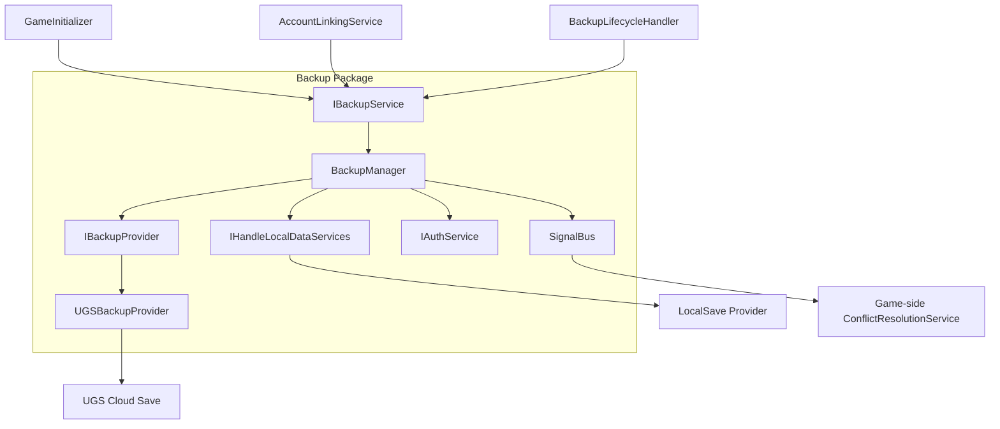
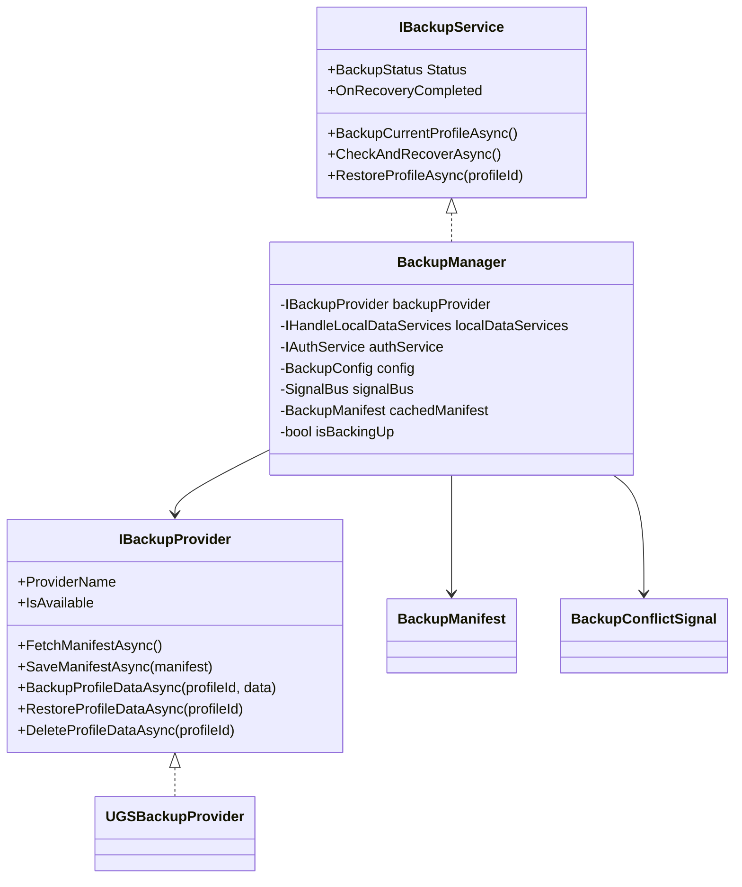
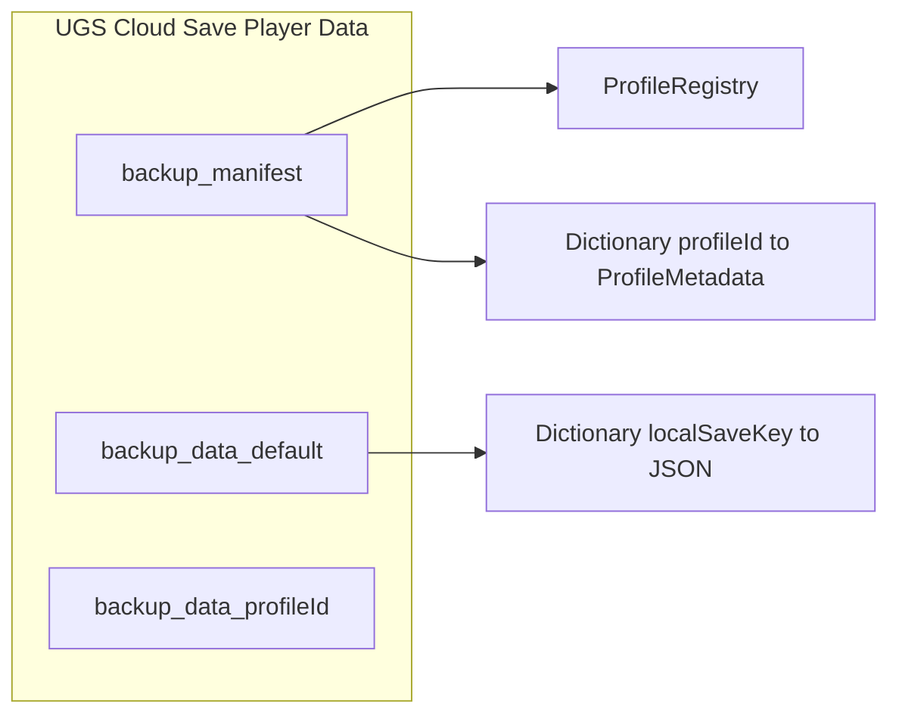
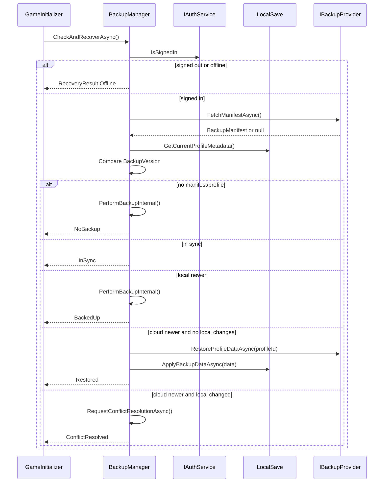
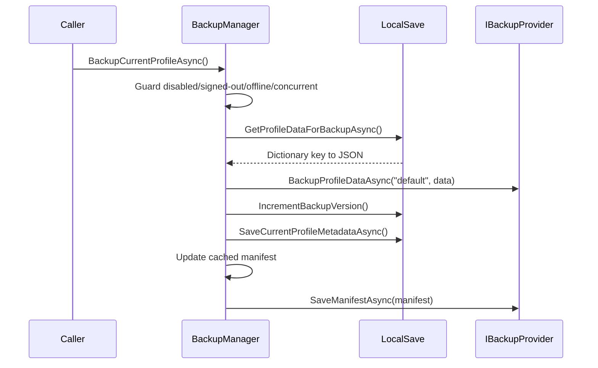
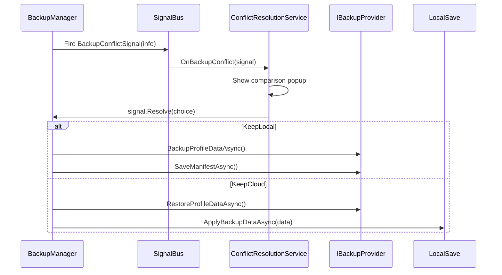
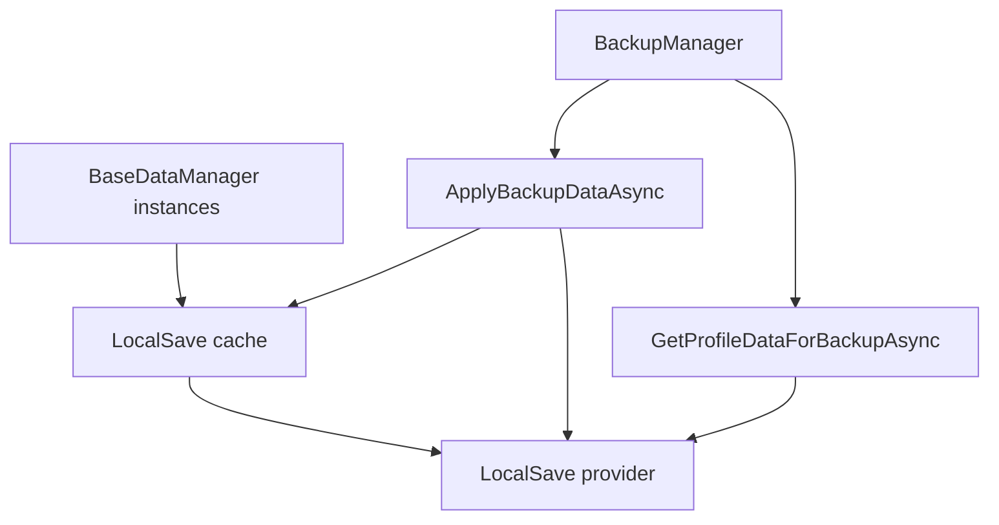

# TDD: Backup Technical Design

> Technical design document for the implemented Backup module.
> The concise operating reference is [backup_system.md](backup_system.md).

## 1. Design Goals

- Treat cloud as backup/recovery, not primary storage.
- Keep LocalSave as the authoritative local runtime persistence layer.
- Minimize cloud reads for the common startup check.
- Keep cloud provider APIs swappable through `IBackupProvider`.
- Keep conflict UI outside the reusable Backup package.
- Fail safely: backup problems should not block gameplay.

## 2. System Context

Backup is an orchestration layer. It does not serialize user data objects directly; it asks LocalSave for key-to-JSON payloads and sends those payloads to the provider.

## 3. Module Boundaries

| Boundary | Owned by Backup package | Owned outside Backup package |
|---|---|---|
| Recovery policy | Compare metadata, choose backup/restore/conflict path. | Decide when startup/account/lifecycle flows call backup. |
| Cloud I/O | Provider interface and UGS Cloud Save implementation. | UGS dashboard/project setup and access policies. |
| Local data I/O | Calls LocalSave backup helper APIs. | LocalSave serialization, encryption, migrations, cache, provider durability. |
| Conflict signaling | Creates `BackupConflictSignal` and waits for resolution. | Shows UI and calls `Resolve()` with player choice. |
| Auth guard | Requires `IAuthService.IsSignedIn`. | Auth provider/session management. |

The design keeps `GameFoundation.Backup` free of UIModule dependencies. The game layer owns conflict presentation.

## 4. Component Design

`BackupManager` owns orchestration and policy. `UGSBackupProvider` owns key naming and UGS Cloud Save calls.

## 5. Cloud Data Model

### Manifest

`BackupManifest` contains:

| Field | Purpose |
|---|---|
| `Registry` | Profile ids known to the cloud backup. |
| `ProfileMetadataMap` | Per-profile metadata used for version comparison. |
| `LastUpdatedAt` | Cloud manifest update timestamp. |

The manifest lets startup compare local and cloud versions with one lightweight read.

### Profile Payload

Each `backup_data_{profileId}` key stores a `Dictionary<string, string>` where:

- key = LocalSave data key, such as `LD-UserCommonData`
- value = JSON string for that data object

The provider does not parse individual gameplay data objects.

## 6. Startup Recovery Sequence

This check runs before user data managers load, so restored JSON can be written to LocalSave first.

## 7. Backup Sequence

The operation writes the heavy profile data before updating the manifest. This avoids advertising a newer manifest version before the payload is uploaded.

## 8. Conflict Resolution Sequence

`BackupConflictSignal` contains a `UniTaskCompletionSource<ConflictChoice>`. This allows the reusable package to wait for a game-layer UI decision without referencing the UI assembly.

## 9. LocalSave Coordination

Backup uses LocalSave through `IHandleLocalDataServices` only. This avoids a cloud dependency in gameplay data managers.

Important design implication: backup reads provider data, not arbitrary unsaved RAM changes. Callers that need a strong backup checkpoint should first call `SaveCurrentProfile()`.

## 10. Failure And Concurrency Design

| Failure / race | Current handling |
|---|---|
| Backup disabled | Return offline/no-op depending on API. |
| Signed out | Return offline/no-op and log. |
| No network | Return offline/no-op and log. |
| Concurrent backup | `isBackingUp` skips overlapping backup requests. |
| Recovery while busy | Skips when status is `BackingUp` or `Restoring`. |
| Cloud provider exception | Caught in service layer, status becomes `Error`. |
| Conflict signal missing | Default to `KeepLocal`. |
| Conflict timeout | Default to `KeepLocal`. |
| UGS package missing | Provider methods log skipped operations and return null/no-op. |

Backup failures intentionally do not throw into gameplay startup in the normal game integration path.

## 11. Security Design

Current client-writable mode is suitable for internal testing and early rollout. Hardening already present:

- Cloud JSON deserialization uses `TypeNameHandling.None`.
- Missing fields are ignored for forward compatibility.
- Backup is auth-gated.
- Local files remain protected by LocalSave encryption when configured.

Future server-authoritative mode should keep `IBackupService` stable and move writes into a provider or Cloud Code layer.

## 12. Design Tradeoffs

| Decision | Reason | Cost |
|---|---|---|
| Backup, not sync | Clear push/recover mental model. | Not real-time multi-device synchronization. |
| Manifest plus data keys | Fast startup comparison. | Backup writes need two cloud calls. |
| UI-agnostic conflict signal | Avoids package dependency cycle. | Game layer must bind a signal handler. |
| Provider reads raw LocalSave JSON | Reuses existing serialization/migration boundaries. | Backup can upload stale data if local cache is not flushed. |
| Auth-gated cloud operations | Prevents orphaned cloud writes. | Offline/anonymous-only recovery is unavailable. |

## 13. Current Technical Debt

- `BackupConfig.CheckOnLaunch` is not used by `GameInitializer`.
- `BackupConfig.ConflictTimeoutSeconds` is not used by `RequestConflictResolutionAsync()`, which currently waits 300 seconds.
- `BackupManager.GetCurrentProfileId()` returns hard-coded `"default"`.
- Backup has no direct checkpoint contract with LocalSave yet.
- Direct client writes to Cloud Save are not server-authoritative.

## 14. Verification Matrix

| Test area | Checks |
|---|---|
| DI binding | `BackupInstaller` binds provider, manager, lifecycle handler, and signal. |
| Startup recovery | No manifest, profile missing, in-sync, local-newer, cloud-newer, conflict. |
| Cloud provider | Manifest load/save, profile data load/save/delete, missing UGS package no-op. |
| LocalSave integration | Backup reads expected keys; restore applies data before managers load. |
| Conflict UI boundary | Signal fires, handler resolves, no-handler fallback keeps local. |
| Lifecycle | Pause backs up, resume checks recovery, config toggles are respected where wired. |
| Failure behavior | No network, signed out, provider exception, concurrent operations. |
