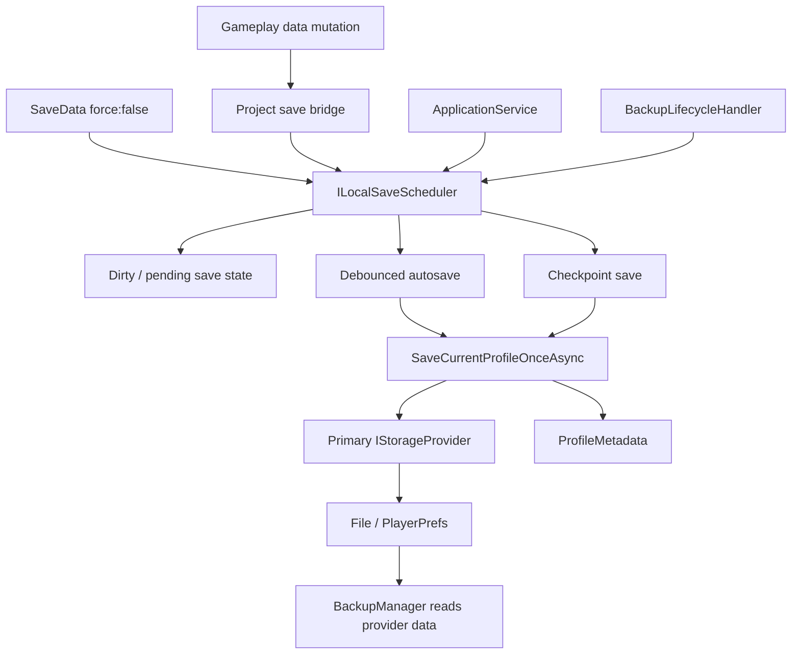

# TDD: LocalSave Stability Improvement

> Technical design for reducing local progress loss caused by crashes, forced process kills, and fast close/reopen flows.
> Written 2026-06-16. Updated 2026-06-17 with quick-stabilization implementation status.
>
> Current-system reference: [local_data_system.md](local_data_system.md).

## 1. Purpose

Improve LocalSave durability so player progress is written soon after meaningful state changes instead of relying mostly on scene/lifecycle saves. The goal is to reduce the amount of progress that can be lost if the game crashes, the OS kills the process, or the player closes/reopens the game before a lifecycle save finishes.

This TDD now has two layers:

- Quick stabilization already implemented: save coalescing plus a few high-value checkpoints.
- Scheduler v1 still proposed: dirty tracking, debounced autosave, reason-coded checkpoints, backup coordination, and timeout policy.

## 1.1 Implementation Status As Of 2026-06-17

Implemented in this pass:

| Item | Status | Notes |
|---|---|---|
| Central save coalescing | Done | `ProfileSaveGate` prevents overlapping `SaveCurrentProfile()` drains and runs follow-up passes when newer requests arrive during a save. |
| `ApplicationService` dropping guard removed | Done | Lifecycle save requests now forward to `HandleLocalDataServices`; `ApplicationService.IsSaving` proxies central save state. |
| `IHandleLocalDataServices.IsSavingCurrentProfile` | Done | Exposes central save state for lifecycle/backup observers. |
| `SaveData(force:true)` routes through full-profile checkpoint | Done | Current code calls `SaveCurrentProfile()` after updating cache. |
| Return-to-town checkpoint | Already present | `UserCommonManager` subscribes to `EnterTownSignal`. |
| Grouped payout checkpoint | Already present | `UserCommonManager` subscribes to `PayoutsReceivedSignal`. Single `PayoutReceivedSignal` is intentionally avoided. |
| Pre-payment checkpoint | Done | `TransactionManager` saves after cost verification and before payment mutation. |
| EditMode gate tests | Added | `ProfileSaveGateTests` documents coalescing and failure behavior. Test runner execution may need a later session if tooling rejects the run. |

Not implemented yet:

- Dirty-key tracking.
- Debounced autosave for ordinary mutations.
- `ILocalSaveScheduler` public interface.
- Save reason enum and structured save metrics.
- Backup lifecycle migration to a scheduler checkpoint API.
- Profile-wide batch/snapshot transaction commit.

## 2. Problem Statement

The current file provider is reasonably safe once a write starts: it writes `.tmp`, flushes to disk, renames through `.bak`, and recovers interrupted files on startup. That prevents many corruption cases.

The main data-loss issue is earlier in the flow: many gameplay changes remain only in memory until `SaveCurrentProfile()` runs and completes. A crash before that point loads the older provider state on next launch.

```text
gameplay mutation
  -> object in localDataCache changes
  -> no immediate provider write
  -> crash / forced kill / short background window
  -> old file data is loaded next launch
```

## 3. Current Failure Modes

| Failure mode | Current behavior | Player impact |
|---|---|---|
| `SaveData(force:false)` | Updates `localDataCache` only. | Any unsaved change can be lost on crash. |
| Direct `BaseDataManager<T>.Data` mutation | Managers commonly mutate the loaded object without telling LocalSave. | LocalSave cannot know a save is needed. |
| Fire-and-forget lifecycle save | `ApplicationService` calls `SaveCurrentProfile().Forget()`. | Quit/pause/focus events may return before save finishes. |
| In-flight lifecycle save guard | Mitigated by `ProfileSaveGate`. | Save requests are coalesced and followed by another pass if a newer request arrived during the active pass. |
| Backup reads disk | `GetProfileDataForBackupAsync()` reads provider data. | Cloud backup can upload stale data if local cache was not flushed. |
| Too many full-profile saves | Current checkpoints call `SaveCurrentProfile()`, which saves all cached data. | Save pressure can hurt performance if checkpoints are attached to high-frequency events. |
| Per-key file commits | `SaveCurrentProfile()` writes multiple files independently. | A crash between keys can leave a mixed old/new profile state. This is deferred to v2. |

## 4. Design Goals

- Persist important progress quickly, before app lifecycle events.
- Avoid blocking every small mutation on disk I/O.
- Avoid dropping save requests that arrive during an active save.
- Keep the current `IHandleLocalDataServices` API source-compatible.
- Keep `FileStorageProvider` atomic-file behavior unchanged in v1.
- Coordinate backup so cloud upload sees freshly flushed local data.
- Keep gameplay-specific signal subscriptions out of the reusable GDK LocalSave package.

## 5. Non-Goals For Scheduler V1

- No profile-wide transactional snapshot format.
- No save-file schema change.
- No cloud provider added to `StorageProviderFactory`.
- No secondary provider / dual-write reintroduction.
- No automatic deep mutation tracking inside arbitrary POCOs.

## 6. Target Architecture: Scheduler V1

Scheduler v1 is still future work. The current quick stabilization has `ProfileSaveGate`, but Scheduler v1 would make `HandleLocalDataServices` responsible for dirty scheduling in addition to actual persistence.



Scheduler v1 has two save modes:

| Mode | Trigger | Behavior |
|---|---|---|
| Autosave | Ordinary dirty state | Debounced save after a short delay. Good for frequent small changes. |
| Checkpoint | High-value state change or lifecycle/backup event | Awaited save request that drains pending work before returning. |

## 7. Proposed Public API

Add a LocalSave scheduler interface:

```csharp
public interface ILocalSaveScheduler
{
    bool IsSaving { get; }
    bool HasPendingSave { get; }

    void RequestAutosave(LocalSaveReason reason);
    UniTask SaveCheckpointAsync(LocalSaveReason reason);
}
```

Add a reason enum for logging, debugging, and future metrics:

```csharp
public enum LocalSaveReason
{
    DataChanged,
    ForceSave,
    SceneLoaded,
    AppPause,
    AppFocusLost,
    AppQuit,
    AppDestroy,
    Backup,
    ProfileSwitch,
    Manual
}
```

Add `LocalSaveConfig` fields:

| Field | Default | Purpose |
|---|---|---|
| `enableAutosave` | `true` | Master toggle for scheduler autosaves. |
| `autosaveDebounceSeconds` | `2.0` | Delay after ordinary dirty marks before flushing. |
| `checkpointTimeoutSeconds` | `10.0` | Upper bound for lifecycle/backup waits. |

`HandleLocalDataServices` should implement both `IHandleLocalDataServices` and `ILocalSaveScheduler`. `DataManagerInstaller` should bind the same singleton instance to both interfaces.

## 8. Proposed Behavior Changes

### `SaveData`

```text
SaveData(data, force:false)
  -> cache data
  -> RequestAutosave(DataChanged)

SaveData(data, force:true)
  -> cache data
  -> await SaveCheckpointAsync(ForceSave)
```

### `SaveCurrentProfile`

`SaveCurrentProfile()` remains public for compatibility, but delegates to `SaveCheckpointAsync(Manual)`.

The current save body is already separated as `SaveCurrentProfileOnce()`. Scheduler v1 can reuse this as the actual write pass, or split it further if dirty-key saves are introduced.

The old save body moves to a private method such as `SaveCurrentProfileOnceAsync(LocalSaveReason reason)`. That method snapshots `localDataCache.ToArray()` before writing so concurrent cache changes do not break enumeration.

### Non-Dropping Save Drain

Scheduler v1 must not drop save requests while a save is active.

```text
if no save is active:
  start save drain

if save is active:
  set pendingSaveRequested = true
  return or await the active drain depending on caller

after each save pass:
  if pendingSaveRequested:
    clear pending flag
    run another save pass
  else:
    finish
```

If a provider save fails, pending state should remain true so the next autosave/checkpoint retries. Errors are logged and rethrown for awaited checkpoint saves.

## 9. Integration Points

### `HandleLocalDataServices`

Owns scheduler state and all save draining. It remains the only class that serializes user data and writes to providers.

Required internal state:

- `bool isSaving`
- `bool pendingSaveRequested`
- `UniTaskCompletionSource` or equivalent for callers awaiting the active drain
- cancellation/version token for debounce replacement
- last save reason for logs

### `ApplicationService`

Replace the current local `Interlocked` guard with scheduler calls.

| Event | Scheduler call |
|---|---|
| Scene loaded | `SaveCheckpointAsync(SceneLoaded).Forget()` |
| `OnApplicationPause(true)` | `SaveCheckpointAsync(AppPause).Forget()` |
| `OnApplicationFocus(false)` | `SaveCheckpointAsync(AppFocusLost).Forget()` |
| `OnApplicationQuit()` | `SaveCheckpointAsync(AppQuit).Forget()` best effort |
| `OnDestroy()` | `SaveCheckpointAsync(AppDestroy).Forget()` best effort |

`ApplicationService.IsSaving` should proxy `ILocalSaveScheduler.IsSaving` so existing external checks remain meaningful.

### `BackupLifecycleHandler`

Before cloud backup, call `await SaveCheckpointAsync(Backup)`. Backup should not separately wait on `ApplicationService.IsSaving`; the scheduler is the single coordination point.

### Project-Side Gameplay Save Bridge

Create a project-specific bridge in `Assets/Scripts/Services/LocalSave/` and bind it from the game project installer. This avoids putting gameplay signal dependencies into the GDK LocalSave package.

Recommended event policy:

| Signal/source | Save mode |
|---|---|
| `MakePaymentSuccessSignal` | Checkpoint |
| `PayoutsReceivedSignal` / `PayoutReceivedSignal` | Checkpoint |
| `InventoryManager.ItemChangeStateSignal` | Checkpoint |
| `EarnCurrencySignal` / `SpendCurrencySignal` | Autosave |
| `QuestChangeStatusSignal` / `TaskChangeStatusSignal` | Autosave |
| Region/zone/tutorial completion flows | Checkpoint if already centralized, otherwise autosave |

Managers that already call `SaveCurrentProfile()` continue to work; they simply route through the scheduler after implementation.

## 10. Data Flow

### Ordinary Mutation

```text
gameplay changes cached data
  -> save bridge or SaveData(force:false) requests autosave
  -> debounce timer starts/restarts
  -> one save drain writes current cache snapshot
```

### High-Value Event

```text
purchase / payout / item grant / quest reward
  -> save bridge requests checkpoint
  -> scheduler drains pending work now
  -> caller may continue after checkpoint completes
```

### Pause And Backup

```text
app pause
  -> ApplicationService requests checkpoint
  -> BackupLifecycleHandler requests checkpoint before cloud upload
  -> scheduler coalesces overlapping requests
  -> backup reads provider data after local save drain
```

## 11. Failure Handling

| Failure | V1 behavior |
|---|---|
| Provider write exception | Current quick behavior faults awaiting callers and clears the active drain. Scheduler V1 should log, keep pending save state, and rethrow to checkpoint caller. |
| Autosave exception | Log and keep pending state for retry. |
| Checkpoint timeout | Log timeout; do not clear dirty/pending state unless a save actually completed. |
| App quit returns before async save completes | Accepted platform limitation; frequent autosaves/checkpoints reduce the remaining risk window. |
| Crash during file write | Existing `.tmp`/`.bak` recovery handles this at provider startup. |
| Crash between multiple key writes | Still possible in v1; addressed by future batch/snapshot commit. |

## 12. Test Plan

Add EditMode tests under `LocalSave/Tests/Editor`.

Existing/added tests:

- `ProfileSaveGateTests` verifies overlapping requests coalesce into a follow-up save pass.
- `ProfileSaveGateTests` verifies failed saves fault awaiting callers and clear saving state.
- Existing legacy migration and encryption tests should remain green.

Required later Scheduler v1 tests:

- `SaveData(force:false)` schedules a debounced save and eventually persists.
- `SaveData(force:true)` persists before returning.
- A save request made during an active save runs a second save afterward.
- Failed provider save keeps pending state and retries on the next checkpoint.
- `SaveCurrentProfile()` preserves existing public behavior.
- Application lifecycle calls route through the scheduler and do not drop overlapping requests.
- Backup lifecycle calls checkpoint save before profile data is collected.
- Existing legacy migration and encryption tests remain green.

Manual QA:

- Kill the app immediately after a reward claim; reward should survive if checkpoint completed.
- Kill the app after ordinary currency changes; only the debounce window should be at risk.
- Background/resume on Android and iOS without ANR regression.
- Verify cloud backup uploads latest local state after app pause.

## 13. V1 Acceptance Criteria

- No source-breaking changes to existing `IHandleLocalDataServices` consumers.
- `SaveData(force:false)` no longer leaves data dirty forever without a scheduled flush.
- Save requests during an active save are coalesced and drained, not dropped.
- Backup uploads after a scheduler checkpoint, not before local disk is fresh.
- No change to persisted JSON shape or file names.
- No reintroduction of secondary providers or CloudSave into LocalSave.

## 14. Future V2: Profile Transaction Commit

Scheduler v1 reduces the largest loss window: unsaved memory. It does not make a multi-key profile save atomic.

Future v2 should evaluate one of these approaches:

| Option | Summary |
|---|---|
| Manifest generation commit | Write each key with a generation id, then atomically update metadata to mark the generation committed. |
| Profile snapshot file | Serialize all profile data into one atomic snapshot file. |
| Batch provider API | Add `SaveBatchAsync(profileId, keyJsonPairs)` for providers that can commit a group. |

The v2 goal is to avoid mixed-key states when a transaction changes wallet, inventory, quest, and common data together.

## 15. Open Risks

| Risk | Mitigation |
|---|---|
| Full-profile checkpoint saves cause too much I/O on mobile | Keep checkpoints limited to high-value events; add debounced autosave and dirty-key saves later. |
| Save bridge misses a gameplay mutation | Keep existing lifecycle saves; incrementally add direct manager calls for critical flows. |
| Checkpoint save adds latency to reward flows | Use checkpoint only after state mutation, before non-critical UI continuation where possible. |
| Provider writes are still per-key | Documented v1 limitation; solve in v2 batch/snapshot work. |

