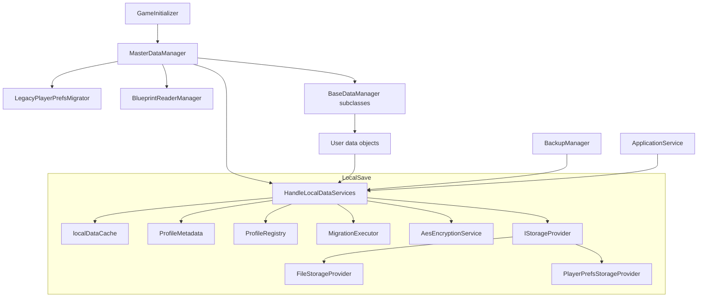
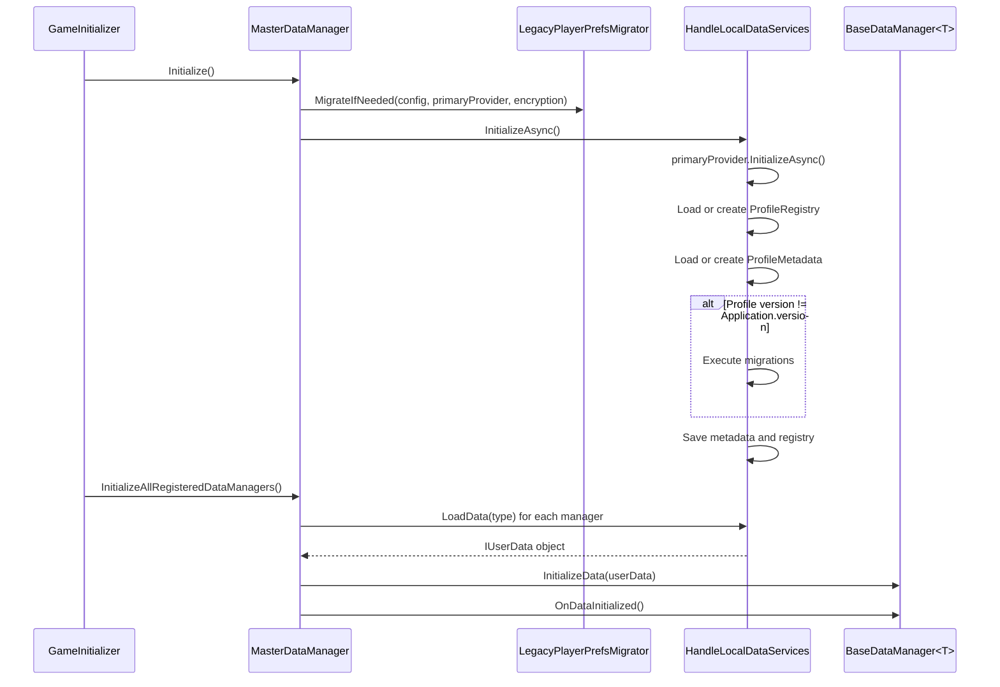

# LocalSave System Spec

> Canonical technical reference for the current LocalSave persistence system.
> Updated 2026-06-17.
>
> For the longer-term durability design and implementation handoff, see [TDD_LocalSaveStability.md](TDD_LocalSaveStability.md).

## 1. Purpose

`LocalSave` owns local user-data persistence for the game. It loads, caches, saves, encrypts, migrates, and profile-scopes classes that implement `IUserData`.

The current implementation is a manager plus provider architecture:

- `HandleLocalDataServices` owns profile logic, cache, encryption, metadata, migrations, and backup helpers.
- `IStorageProvider` implementations own raw string storage.
- `MasterDataManager` orchestrates startup and connects loaded data to `BaseDataManager<T>` gameplay managers.

This document describes the system as implemented today. It intentionally does not describe older `LocalData` names, `DataManagerConfig`, CloudSave providers, or secondary-provider dual-write behavior because those are not present in the current code.

## 2. Source Layout

```text
Packages/com.gdk.core/Scripts/DataManager/
|-- DataManagerInstaller.cs
|-- MasterData/MasterDataManager.cs
|-- UserData/BaseDataManager.cs
`-- LocalSave/
    |-- LocalSaveConfig.cs
    |-- ApplicationService.cs
    |-- Handler/HandleLocalDataServices.cs
    |-- Handler/IHandleLocalDataServices.cs
    |-- Handler/LegacyPlayerPrefsMigrator.cs
    |-- Provider/FileStorageProvider.cs
    |-- Provider/PlayerPrefsStorageProvider.cs
    |-- Provider/IStorageProvider.cs
    |-- Provider/StorageProviderFactory.cs
    |-- Encryption/
    |-- Migration/
    |-- Profile/
    `-- Tests/Editor/
```

## 3. Runtime Architecture



| Type | Responsibility |
|---|---|
| `LocalSaveConfig` | Config source for the primary storage provider, legacy version stamp, and encryption salt prefix. |
| `HandleLocalDataServices` | Main service for cache, profiles, metadata, migrations, encryption, provider dispatch, backup helpers, and full-profile save pass. |
| `ProfileSaveGate` | Internal save gate that coalesces overlapping `SaveCurrentProfile()` requests into one active drain plus follow-up passes when needed. |
| `IHandleLocalDataServices` | Public API consumed by gameplay, master data, backup, and lifecycle code. |
| `IStorageProvider` | Low-level raw JSON storage abstraction. No object serialization or cache. |
| `FileStorageProvider` | Production local file backend under `Application.persistentDataPath`. |
| `PlayerPrefsStorageProvider` | PlayerPrefs backend for testing/fallback compatibility. |
| `ApplicationService` | Lifecycle hook that requests saves on scene load, pause, focus loss, quit, and destroy. |

## 4. Configuration

`LocalSaveConfig` is a `ScriptableObject` game config. It currently exposes:

| Field | Default | Purpose |
|---|---|---|
| `primaryProvider` | `FileBased`, encrypted, `SaveData` folder | The only provider used for reads and writes in the current code. |
| `lastKnownLegacyVersion` | `0.1.0` | Version assigned to legacy PlayerPrefs data before migration chains run. |
| `encryptionSaltPrefix` | `BackpackAdventures` | Prefix used by `AesEncryptionService` key derivation. Changing this after release makes existing encrypted saves unreadable. |

`StorageProviderType` currently supports `FileBased` and `PlayerPrefs`. There is no current secondary-provider array, CloudSave provider, or dual-write path in `HandleLocalDataServices`. Cloud backup is handled by the separate Backup module.

## 5. Initialization Flow



`BaseDataManager<T>` stores a protected `Data` reference. Most gameplay managers mutate that object directly after initialization.

## 6. Save And Load Flow

```text
LoadData<T>()
  -> build key: LD-{TypeName}
  -> return from localDataCache if present
  -> primaryProvider.LoadAsync(profileId, key)
  -> decrypt if provider uses encryption
  -> deserialize with tolerant Json.NET settings
  -> create a new instance if missing/null
  -> cache and return
```

```text
SaveData<T>(data, force:false)
  -> localDataCache[key] = data
  -> return without disk write

SaveData<T>(data, force:true)
  -> localDataCache[key] = data
  -> SaveCurrentProfile()

SaveCurrentProfile()
  -> EnsureInitialized()
  -> ProfileSaveGate.RequestSave(SaveCurrentProfileOnce)
  -> coalesce overlapping requests
  -> save every object currently in localDataCache
  -> SaveCurrentProfileMetadataAsync()
```

`SaveJsonInternal` serializes the object, encrypts when appropriate, writes to the primary provider, and tracks user-data keys in `ProfileMetadata.DataKeys`. `ProfileMetadata` and `ProfileRegistry` are intentionally not encrypted.

## 6.1 Save Coalescing

`ProfileSaveGate` is the current lightweight guard around full-profile saves.

Behavior:

- The first `SaveCurrentProfile()` request starts a drain.
- Requests that arrive while the drain is active return the active completion task instead of starting parallel writes.
- Each request increments an internal version counter.
- After each save pass, the drain compares the version it saved against the latest requested version.
- If a newer request arrived during the pass, the drain runs one more pass.
- The drain completes only after it has saved the latest requested version.

This avoids the old `ApplicationService` pattern where in-flight lifecycle saves could cause later save requests to return immediately and be dropped.

`ProfileSaveGate` does not debounce saves and does not track dirty keys. If high-frequency code repeatedly calls `SaveCurrentProfile()` over time, it can still cause repeated full-profile saves. Callers should reserve direct checkpoint saves for high-value events.

## 7. Runtime File Structure

For the file provider, data lives under `Application.persistentDataPath`:

```text
{persistentDataPath}/SaveData/
|-- _global/
|   `-- __ProfileRegistry__.json
`-- default/
    |-- ProfileMetadata.json
    |-- LD-UserCommonData.json
    |-- LD-WalletData.json
    |-- LD-UserInventory.json
    `-- ...
```

`profileId == null` maps to `_global`. The default production profile is `default`.

## 8. Storage Providers

### FileStorageProvider

`FileStorageProvider` stores each key as one `.json` file. Its save path is designed to avoid corrupting the last valid save if the app is interrupted during a file write:

```text
target.json.tmp <- write full contents and flush to disk
target.json     -> target.json.bak, if an old target exists
target.json.tmp -> target.json
target.json.bak deleted after success
```

Durability behavior:

- Uses a per-file `SemaphoreSlim` to prevent concurrent writes to the same key.
- Runs blocking file I/O on a thread pool thread.
- Uses `FileOptions.WriteThrough` and `fs.Flush(flushToDisk: true)` for stronger mobile durability.
- Recovers orphaned `.tmp` or `.bak` files during provider initialization.
- Keeps at least one valid copy during the rename sequence where the filesystem supports the expected move behavior.

This protects against file corruption during writes. It does not protect data that only exists in memory and has not been sent to the provider yet.

### PlayerPrefsStorageProvider

`PlayerPrefsStorageProvider` stores raw strings under:

```text
global:  {key}
profile: {profileId}_{key}
```

It calls `PlayerPrefs.Save()` after writes and deletes. It is primarily for editor/testing/fallback compatibility.

## 9. Encryption

`HandleLocalDataServices` applies encryption before writing and decryption after reading when both conditions are true:

- The provider reports `UseEncryption == true`.
- An `IEncryptionService` is available.

Current encryption service:

| Type | Details |
|---|---|
| `AesEncryptionService` | AES-256-CBC with PKCS7 padding. Key material is derived from device-specific data and `LocalSaveConfig.EncryptionSaltPrefix`. |

User data files are encrypted by default for file/PlayerPrefs providers. `ProfileMetadata` and `ProfileRegistry` are not encrypted so migration/profile logic can read them directly.

## 10. Profile Metadata

`ProfileRegistry` is global and tracks available profile ids plus the current profile id.

`ProfileMetadata` is per profile and tracks game version, created/last played/last saved timestamps, migration history, saved data keys, backup version, and last backup timestamp.

The current production flow uses the `default` profile, but the service exposes create/switch/delete profile APIs for future multi-profile support.

## 11. Migration

There are two migration layers:

1. `LegacyPlayerPrefsMigrator` copies old PlayerPrefs keys into the provider-based format once. It preserves the old PlayerPrefs keys as a rollback safety net.
2. `MigrationExecutor` runs `[Migration(fromVersion, toVersion)]` classes when profile metadata version differs from `Application.version`.

Legacy migration runs before `HandleLocalDataServices.InitializeAsync()` so the normal load path can discover migrated files.

## 12. Backup Integration

Cloud backup is implemented outside LocalSave in `Packages/com.gdk.core/Scripts/Backup/`.

LocalSave exposes backup helpers:

| Method | Behavior |
|---|---|
| `GetProfileDataForBackupAsync()` | Reads saved profile data from disk/provider and returns key-to-JSON pairs for backup. |
| `ApplyBackupDataAsync()` | Applies cloud data to the current profile, updates cache, and persists through the primary provider. |
| `IncrementBackupVersion()` | Updates in-memory metadata after successful backup. |

Important limitation: backup reads saved provider data. If gameplay progress is still only in `localDataCache`, backup will upload stale data. Backup improves cross-device recovery but is not a substitute for timely local persistence.

## 13. Application Lifecycle Saves

`ApplicationService` requests `SaveCurrentProfile()` when a scene loads, the app pauses, the app loses focus, the app quits, or the service is destroyed.

The current lifecycle save is asynchronous and fire-and-forget. It reduces normal close/reopen data loss, but it cannot guarantee that unsaved RAM state survives hard crashes, forced process kills, or very short mobile background windows.

## 13.1 Current Save Points

Current checkpoint-style save requests:

| Source | Trigger | Notes |
|---|---|---|
| `ApplicationService` | scene loaded, app pause, focus lost, quit, destroy | Fire-and-forget lifecycle protection. `IsSaving` proxies `IHandleLocalDataServices.IsSavingCurrentProfile`. |
| `UserCommonManager` | `PayoutsReceivedSignal` | Saves after grouped payout application. Single `PayoutReceivedSignal` is intentionally not used to avoid high-frequency save pressure. |
| `UserCommonManager` | `EnterTownSignal` | Saves when returning to town. |
| `UserCommonManager` | region/zone unlock flows | Existing direct calls to `SaveCurrentProfile()`. |
| `TransactionManager` | after successful cost verification and before payment mutation | Best-effort pre-payment checkpoint. If LocalSave is initialized and this save fails, payment does not proceed. |

These save points are intentionally high value. Avoid adding full-profile saves to per-frame updates, per-kill counters, every currency tick, every single loot pickup, or reactive property changes.

## 14. Known Stability Risk

The current design is cache-first. `SaveData(force:false)` updates memory only, and many gameplay managers mutate their `Data` object directly without immediately calling `SaveData(force:true)` or `SaveCurrentProfile()`.

This creates a data-loss window:

```text
gameplay mutates Data
  -> change exists in memory
  -> app crashes or process is killed before SaveCurrentProfile completes
  -> provider still has older data
  -> next launch loads older progress
```

The file provider's atomic write path prevents corruption of writes that started. It does not persist changes that were never flushed. The quick stabilization pass reduces this risk for lifecycle, return-to-town, grouped payout, forced save, and payment flows. The longer-term scheduler design is documented in [TDD_LocalSaveStability.md](TDD_LocalSaveStability.md).

Performance risk: `SaveCurrentProfile()` writes every object currently in `localDataCache`. The current save gate prevents overlapping full-profile saves, but it does not make full-profile saves cheap. Keep direct save calls limited to high-value checkpoints until dirty-key autosave exists.

## 15. Testing And Verification

Existing editor tests live in `LocalSave/Tests/Editor` and currently cover encryption diagnostics and legacy PlayerPrefs migration.

Manual checks for the current system:

- Delete the `SaveData` folder and verify a fresh default profile is created.
- Save with file encryption on and verify user-data files are not readable JSON.
- Interrupt a file write in development and verify `.tmp`/`.bak` recovery on next startup.
- Seed legacy PlayerPrefs keys and verify migration copies them to the file provider.
- Change `ProfileMetadata.GameVersion` to an older version and verify migration history is updated after launch.

## 16. Future Work

Near-term stability work is Scheduler v1:

- dirty tracking
- debounced autosave
- checkpoint saves for high-value gameplay events
- non-dropping lifecycle save requests
- backup coordination through the same scheduler

Longer-term work is profile-wide batch/snapshot commits so multi-key gameplay transactions cannot be partially persisted across separate files.
